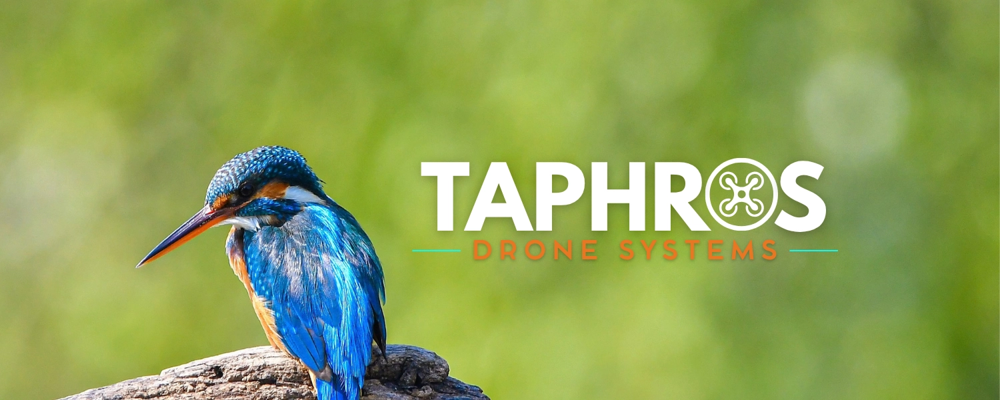

  <!-- Substitua o link da imagem pelo link bruto (raw) do GitHub caso a imagem esteja em outra pasta -->
  
    
  
  
<b>Inovação, Visão Computacional e Desenvolvimento em Drones</b>

  
  
  
    

## 🚀 Sobre Nós

O Capítulo Estudantil IEEE AESS da UFABC é focado no avanço das tecnologias de Drones (VANTs) por meio de pesquisa e desenvolvimento de soluções aeroespaciais. Nosso objetivo é unir teoria e prática em projetos reais, cultivando um ambiente colaborativo de aprendizado. Através de workshops, eventos e parcerias com a indústria, capacitamos estudantes e impulsionamos a inovação no setor de veículos aéreos não tripulados.

---

## 🛠️ Tecnologias & Ferramentas

Trabalhamos com uma stack focada em autonomia, processamento de imagens e análise de dados:

- **Visão Computacional:** OpenCV, YOLO
- **Gerenciamento de Datasets:** Roboflow
- **Linguagens e Análise:** Python, Pandas

---

## 💻 Nossos Projetos

> *Os projetos abaixo seguem a nossa filosofia: descrições objetivas focadas nas habilidades aplicadas e nos problemas resolvidos.*

### 1. Sistema de Visão e Reconhecimento (Exemplo)
**Descrição:** Implementação de visão computacional em tempo real para drones utilizando OpenCV e modelos YOLO. O projeto reforça práticas de otimização de processamento e tomada de decisão autônoma embarcada.
 🔗 [Acessar Repositório](#)

### 2. Gestão de Datasets com Roboflow (Exemplo)
**Descrição:** Repositório colaborativo contendo nossos scripts e processos para anotação, tratamento e limpeza de datasets complexos para treinamento de modelos de detecção.
 🔗 [Acessar Repositório](#)

### 3. Materiais de Workshops (Exemplo)
**Descrição:** Códigos-fonte e apresentações utilizados em nossos eventos acadêmicos. Este repositório reflete nosso compromisso com a comunicação técnica e o desenvolvimento da comunidade local.
 🔗 [https://github.com/IEEE-AESS-Taphros-Drone-Systems/Curso-YOLO-Roboflow](#)

---

## 📫 Contato

Tem interesse em nossos projetos, quer propor uma parceria ou deseja fazer parte do nosso Capítulo Estudantil? Sinta-se à vontade para nos chamar nas nossas redes:

  
  
  

 

  
© 2026 - IEEE AESS UFABC Student Branch

